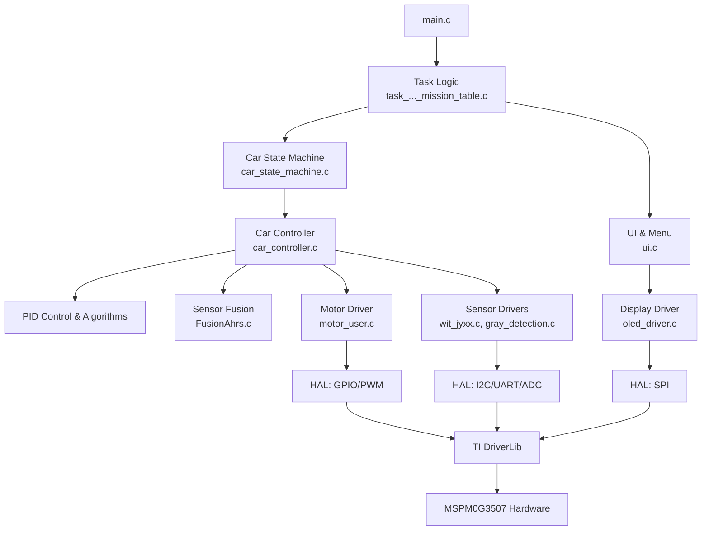

# 智能车项目技术文档 (2024-h-Code)

**文档版本**: 2.0
**生成日期**: 2025-08-07

---

## 1. 项目概览与结构说明

本项目是为全国大学生智能汽车竞赛设计的嵌入式软件项目，基于 **TI MSPM0G3507** (ARM Cortex-M0+) 微控制器。项目采用了分层架构，将应用逻辑、设备驱动和硬件抽象清晰地分离开来，以提高代码的可维护性和可移植性。

### 1.1 项目文件组织结构

```
/mnt/c/Users/kjmsd/Documents/GitHub/ti-contest/2024-H/2024-h-Code/
└───mspm0g3507/
    ├───custom_src/             # [核心] 所有用户自定义的源代码
    │   ├───application/        # 1. 应用层：实现智能车的高级业务逻辑
    │   │   ├───control/        #    - 核心控制算法 (PID, 状态机)
    │   │   ├───task_2021f/     #    - 2021年任务的特定实现
    │   │   ├───task_2022c/     #    - 2022年任务的特定实现
    │   │   └───task_2024h/     #    - 2024年任务的特定实现
    │   ├───core/               # 2. 核心层：系统核心与全局配置
    │   │   ├───config/         #    - 全局配置文件 (宏定义, 日志开关)
    │   │   └───system/         #    - 系统级文件 (中断服务, 任务调度器)
    │   ├───drivers/            # 3. 驱动层：具体硬件设备的驱动程序
    │   │   ├───actuators/      #    - 执行器 (电机, 蜂鸣器, LED)
    │   │   ├───communication/  #    - 通信模块 (蓝牙, 摄像头)
    │   │   ├───display/        #    - 显示 (OLED)
    │   │   └───sensors/        #    - 传感器 (编码器, IMU, 灰度, 激光测距)
    │   ├───hal/                # 4. 硬件抽象层：对MCU底层外设的封装
    │   │   ├───adc/            #    - ADC 抽象接口
    │   │   ├───i2c/            #    - I2C 抽象接口
    │   │   ├───spi/            #    - SPI 抽象接口
    │   │   └───uart/           #    - UART 抽象接口
    │   └───middleware/         # 5. 中间件：提供通用软件服务
    │       ├───communication/  #    - 通信协议 (lwpkt, lwrb)
    │       ├───fusion/         #    - 姿态融合算法
    │       └───ui/             #    - 用户界面库 (菜单, 按键)
    ├───project/                # [工具] Keil MDK 项目文件
    │   ├───Keil/               #    - Keil 工程配置 (*.uvprojx)
    │   └───config/             #    - TI SysConfig 配置文件 (*.syscfg)
    ├───source/                 # [依赖] 第三方库和官方驱动库
    │   ├───third_party/        #    - u8g2, CMSIS等
    │   └───ti/                 #    - TI官方DriverLib
    └───tests/                  # [测试] 单元测试代码
```

## 2. 模块与功能说明

### 2.1 主控与调度 (`core`)

-   **职责**: 负责程序的启动、初始化、任务调度和中断处理。
-   **关键文件**: 
    -   `main.c`: **项目主入口**。初始化系统硬件和应用任务，并启动主循环。
    -   `periodic_event_task.c`: **周期性任务调度器**。提供了一个任务注册表和调度函数，以固定的频率执行各项任务（如传感器读取、PID计算）。
    -   `mspm0g3507_it.c`: **中断服务程序**。处理硬件中断，并将数据分发给相应的处理模块（如将UART数据送入蓝牙接收缓冲区）。
-   **调用关系**: `main()` 初始化并调用 `periodic_event_task_process()`。硬件中断触发 `mspm0g3507_it.c` 中的处理函数。

### 2.2 车辆控制 (`application/control`)

-   **职责**: 实现智能车的核心运动控制算法。
-   **关键文件**:
    -   `car_controller.c`: **车辆运动控制器**。封装了车辆的所有基本动作（直线、转向、巡线），并包含速度环、角度环、巡线环的PID控制实现。
    -   `car_state_machine.c`: **高级任务状态机**。允许将一系列简单动作组合成复杂的任务序列，是实现自动化路径规划的核心。
    -   `car_pid.c`: PID参数的初始化与管理。
-   **数据交互**: `car_controller.c` 从传感器驱动模块获取状态（如速度、角度、线路偏差），计算后输出PWM值给电机驱动模块。

### 2.3 传感器与执行器 (`drivers`)

-   **职责**: 驱动具体的硬件设备，负责数据的发送和接收。
-   **关键文件**: `motor_user.c` (电机), `encoder_user.c` (编码器), `wit_jyxx.c` (IMU), `gray_detection.c` (灰度传感器), `bluetooth.c` (蓝牙)。
-   **调用关系**: 这些驱动模块被 `car_controller.c` 等应用层模块调用，它们自身则调用 `HAL` 层的接口来与硬件交互。

### 2.4 硬件抽象层 (`hal`)

-   **职责**: 屏蔽底层硬件差异，为驱动层提供统一、标准的MCU外设（I2C, SPI, UART, ADC, GPIO）访问接口。
-   **关键文件**: `hal_uart.c`, `hal_spi.c`, `hal_i2c.c`, `hal_adc.c`。
-   **调用关系**: 被 `drivers` 层的模块调用。例如，`bluetooth.c` 通过调用 `hal_uart_send_buffer()` 来发送数据，而无需关心底层UART寄存器的具体操作。

## 3. 项目架构关系图

此图展示了从高层应用到底层硬件的控制流与依赖关系。



## 4. 使用说明（“如何运行项目”)

### 4.1 工具链要求

-   **IDE**: Keil MDK for Arm (v5.36 或更高版本)
-   **编译器**: ARM Compiler 6
-   **硬件**: 基于 MSPM0G3507 的智能车硬件平台
-   **调试器**: TI XDS110 或其他兼容的 SWD 调试器 (如 J-Link, ST-Link)

### 4.2 构建与烧写流程

1.  **打开项目**: 使用 Keil MDK 打开位于 `mspm0g3507/project/Keil/EmbedBolt316.uvprojx` 的工程文件。
2.  **配置调试器**: 在 "Options for Target" -> "Debug" 标签页中，选择你的调试器。
3.  **编译**: 点击 "Build" (F7) 按钮或菜单 `Project -> Build Target` 编译整个项目。
4.  **下载**: 连接好调试器和目标板，点击 "Download" (F8) 或菜单 `Flash -> Download` 将程序烧录到微控制器中。
5.  **调试**: 点击 "Start/Stop Debug Session" (Ctrl+F5) 进入调试模式。

### 4.3 程序启动流程

1.  **硬件入口**: 程序从 `startup/startup_mspm0g350x_uvision.s` (汇编) 文件中的 `Reset_Handler` 开始执行。
2.  **C语言入口**: `Reset_Handler` 跳转到 `main.c` 中的 `main()` 函数。
3.  **系统初始化**: `main()` 首先调用 `system_init()`，此函数会调用 `SYSCFG_DL_init()` 来初始化所有由 TI SysConfig 工具配置的硬件外设（时钟、GPIO、PWM等）。
4.  **任务初始化**: 接着，`main()` 调用 `main_task_init()`，此函数会根据 `CURRENT_TASK_TYPE` 宏来初始化特定年份比赛所需的外设和任务。
5.  **主循环**: 最后，程序进入 `while(1)` 主循环，在循环中不断调用 `periodic_event_task_process()`，由任务调度器负责检查并执行所有到期的周期性任务。

## 5. 如何添加自定义代码

### 5.1 添加周期性任务 (推荐方式)

此方法适用于需要以固定频率重复执行的功能，如传感器轮询、LED闪烁等。

1.  **创建任务函数**: 在 `custom_src/application/` 下创建你的模块文件（如 `my_app.c`），并编写任务处理函数。

    ```c
    // In custom_src/application/my_app.c
    #include "rgb_led.h"
    void my_led_blink_task(void) {
        led_toggle(LED_R); // 切换红色LED状态
    }
    ```

2.  **定义任务ID**: 在 `custom_src/core/system/periodic_event_task.h` 的 `EVENT_IDS` 枚举中添加新ID。

    ```c
    // In periodic_event_task.h
    typedef enum {
        // ... existing tasks
        EVENT_ID_MY_LED_BLINK,  // 新增的任务ID
        EVENT_ID_MAX
    } EVENT_IDS;
    ```

3.  **注册任务**: 在当前年份的任务表（如 `task24h_mission_table.c`）的 `period_tasks` 数组中注册你的任务。

    ```c
    // In task24h_mission_table.c
    extern void my_led_blink_task(void); // 声明你的任务函数
    
    static period_task_t period_tasks[] = {
        // ... existing tasks
        {EVENT_ID_MY_LED_BLINK, 500, my_led_blink_task, RUN}, // {ID, 周期(ms), 处理函数, 初始状态}
    };
    ```

### 5.2 添加状态机任务序列

此方法适用于定义由多个步骤组成的复杂任务路径。

1.  **定义任务函数**: 在年份特定的 `_mission_table.c` 文件中，创建一个函数来定义任务序列。

    ```c
    // In task24h_mission_table.c
    void run_my_custom_path(void) {
        car_clear_actions(); // 清除旧动作
        car_add_straight(50);      // 1. 前进50cm
        car_add_turn(-90);         // 2. 右转90度
        car_add_function(some_custom_function); // 3. 执行一个自定义函数
        car_start();               // 启动状态机
    }
    ```

2.  **绑定到UI**: 在 `_ui_app.c` 中，将此函数绑定到一个菜单项，通过按键触发。

## 6. 风格与结构建议

-   **可移植性**: 
    -   **非可移植部分**: `hal` 目录下的所有代码都与 MSPM0G3507 芯片强耦合，更换MCU需要重写此层。
    -   **可移植部分**: `application`, `middleware` 和大部分 `drivers` 层的逻辑是平台无关的，只需修改其调用的 `HAL` 接口即可移植到其他平台。
-   **模块化扩展**: 
    -   **代码组织**: 所有新增的功能模块都应放在 `custom_src` 目录下对应的文件夹中。例如，新的传感器驱动放在 `drivers/sensors/`，新的应用算法放在 `application/`。
    -   **核心模块**: **请勿随意修改 `core`, `hal` 目录下的文件**。应通过注册新任务、添加新驱动的方式进行扩展。
    -   **抽象层**: 建议为功能类似的驱动建立统一的抽象层。例如，创建一个 `imu_api.h`，无论是 `wit_jyxx` 还是 `mpu6050`，都实现该接口，使上层代码无需关心具体的IMU型号。
